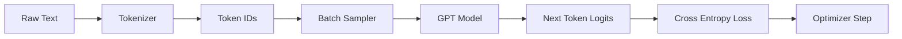
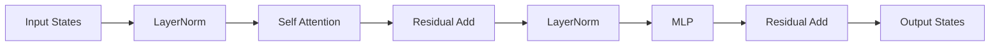
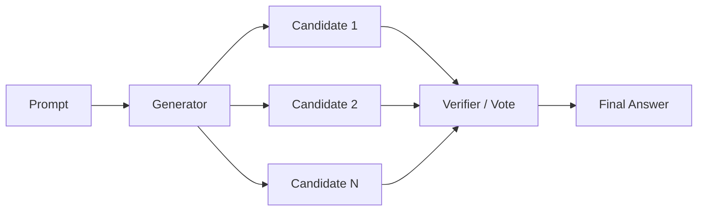

# Figures

这里存放项目中的图解素材说明。

当前仓库同时保留两类素材:

- 轻量草图: Mermaid / Markdown，适合快速表达结构
- 交付级图: SVG，适合放到 README、任务文档和导出 PNG

新增交付级图:

- [harness_artifact_governance.svg](/Volumes/ExtaData/newcode/llm-engineering-lab/assets/figures/harness_artifact_governance.svg)
- [coding_eval_ladder.svg](/Volumes/ExtaData/newcode/llm-engineering-lab/assets/figures/coding_eval_ladder.svg)

## 预训练闭环

## Transformer Block

## 推理增强链路

