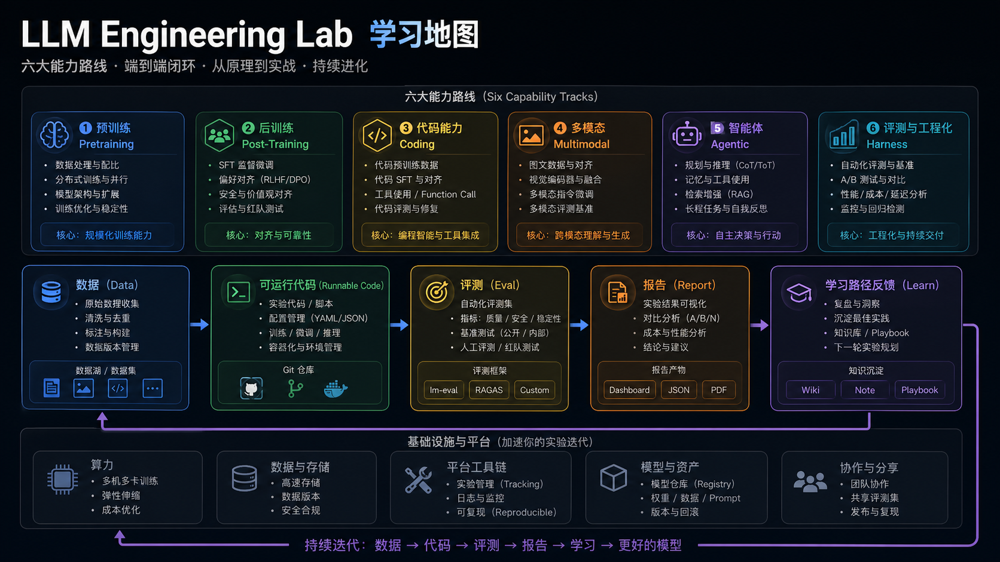

# 代码导览：按六条能力线读 LLM Engineering Lab

`llm-engineering-lab` 的内容很多，不适合从文件树随机读。更好的方式是按六条能力线看：每条线都遵循类似结构：数据、可运行代码、评测、报告、复盘。



## 总体循环

```text
datasets/
  -> code/<stage>/
  -> eval/
  -> runs/
  -> docs/runbook.md
  -> docs/ci_regression_guide_zh.md
```

读代码时不要只看训练脚本。真正的学习闭环是：输入数据是什么，脚本做了什么，评测如何判断，结果怎么进入 harness。

## 六条能力线怎么读

| 能力线 | 先看什么 | 再看什么 |
| --- | --- | --- |
| Pretraining | `code/stage0_bigram/`, `code/stage1_nanogpt_core/` | `tasks/P*.md`, `datasets/tiny_pretraining_*` |
| Post-Training | `code/stage2_sft/`, `code/stage3_reasoning/`, `code/stage4_verifier/` | `eval/sft_eval.py`, `tasks/S*.md` |
| Coding | `code/stage_coding/` | `eval/*coding*.py`, `datasets/tiny_coding*` |
| Multimodal | `code/stage_multimodal/` | `eval/multimodal*.py`, `datasets/tiny_multimodal*` |
| Agentic | `eval/agentic*.py` | `datasets/tiny_agentic*`, `tasks/A*.md` |
| Harness | `code/stage_harness/` | `manifests/`, `docs/ci_regression_guide_zh.md` |

## 推荐最小阅读路径

1. 读 `docs/project_charter.md`
2. 读 `docs/roadmap_v2.md`
3. 跑 `docs/runbook.md` 里的 starter path
4. 选一条能力线深入，不要同时追六条
5. 回到 `docs/ci_regression_guide_zh.md` 理解结果如何进入回归

## 读 eval 比读训练更重要

这个仓库的定位是模型工程，不是单纯训练教程。很多关键思想体现在 eval 里：

- 什么算过关
- 哪些失败可接受
- 如何比较策略
- 如何把输出变成报告

所以每读一个训练脚本，都要配套读一个 eval 脚本。

