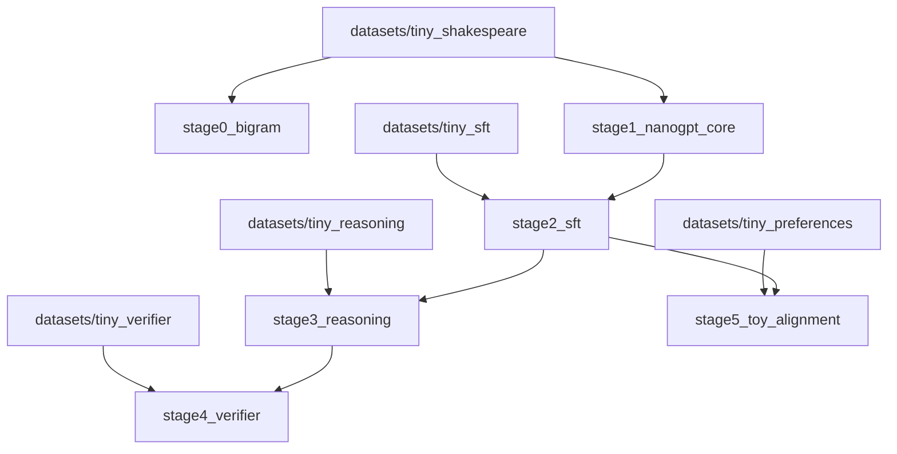

# Architecture

## 一张图看项目结构

## 各阶段职责

- `stage0_bigram`: 让读者先看到最弱语言模型也能形成“预测下一个 token”的闭环
- `stage1_nanogpt_core`: 进入最小 GPT 内核，理解 attention、block 和训练脚本
- `stage2_sft`: 把 base model 变成可按指令输出的助手
- `stage3_reasoning`: 用采样和投票提升多步任务稳定性
- `stage4_verifier`: 给候选答案增加评分和重排能力
- `stage5_toy_alignment`: 用最小偏好优化实验解释 alignment 改了什么

## 数据设计原则

- 尽量使用极小但有业务代入感的数据
- 优先选能清楚对照前后差异的任务
- 不追求复杂语料，只追求闭环和解释力

